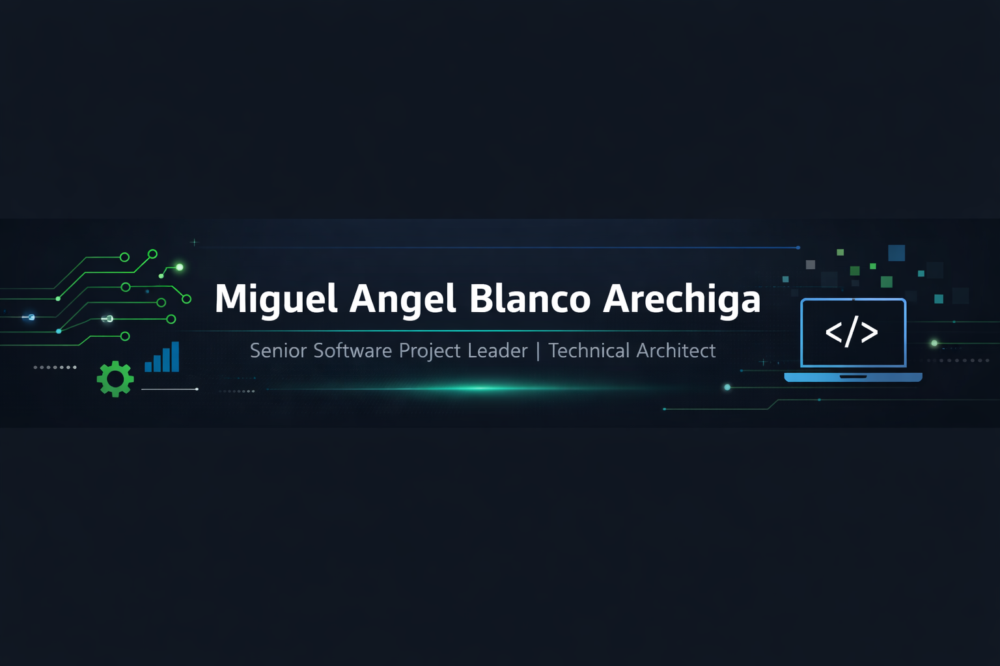

# 🚀 Miguel Angel Blanco Arechiga – Digital Portfolio

---

## 👋 About Me / Sobre mí
**EN:** Senior Software Project Leader & Technical Architect with 10+ years of experience in software development, system migration, and modular construction projects.  
**ES:** Líder Senior de Proyectos de Software y Arquitecto Técnico con más de 10 años de experiencia en desarrollo de software, migración de sistemas y proyectos de construcción modular.  

---

## 📂 Portfolio Highlights / Proyectos Destacados
- 🔧 **System Migration** | Migración de Sistemas  
  *C++ → Java/Spring Boot, +90% performance improvement*  
- 📈 **Innovation Projects** | Proyectos de Innovación  
  *Scrum teams, delivery cycle reduced by 40%*  
- ⚡ **Operational Optimization** | Optimización Operativa  
  *Fingerprint engine batch reduced from 12h → 5h*  
- 🔐 **DevOps & Security** | DevOps y Seguridad  
  *CI/CD pipelines, embedded security controls*  

---

## 🛠 Tools & Technologies / Herramientas y Tecnologías

---

## 🌐 Connect with Me / Conecta conmigo
- [LinkedIn](https://linkedin.com/in/miguelblanco)  
- [GitHub](https://github.com/miguelblanco)  
- [Portfolio Website](https://miguelblancoportfolio.com)  

---

## Versión en Español

### 👋 Sobre mí
Líder Senior de Proyectos de Software y Arquitecto Técnico con más de 10 años de experiencia en desarrollo de software, migración de sistemas y proyectos de construcción modular. Experto en liderar equipos multidisciplinarios, optimizar procesos y entregar soluciones de alto impacto.

### 🚀 Proyectos Destacados
- **Migración de Sistemas**: Lideré la migración de C++ a Java/Spring Boot, logrando +90% de mejora en rendimiento.  
- **Proyectos de Innovación**: Dirigí equipos Scrum, reduciendo ciclos de entrega en 40%.  
- **Optimización Operativa**: Reduje el procesamiento batch del motor de huellas de 12h a 5h.  
- **DevOps & Seguridad**: Implementé pipelines CI/CD y controles de seguridad en todo el ciclo de desarrollo.  

### 🛠 Herramientas y Tecnologías
Visual Studio Code · Visual Basic 6.0 · Informix · PostgreSQL · GitHub · Jira · Scrum · CI/CD · DevOps

### 🌐 Enlaces
- LinkedIn: [linkedin.com/in/miguelblanco](https://linkedin.com/in/lic-miguelblanco)  
- GitHub: [github.com/miguelblanco](https://github.com/lic-miguelblanco)  
- Portfolio Website: [miguelblancoportfolio.com](https://miguelblancoportfolio.com)   
# portfolio-fullstack-senior
